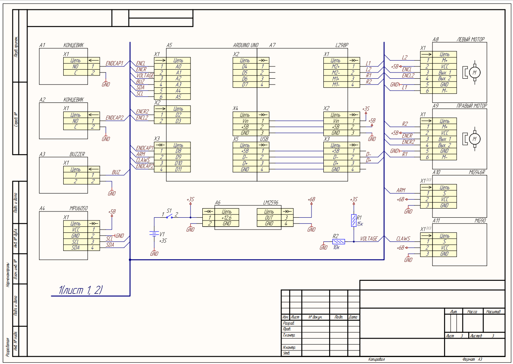
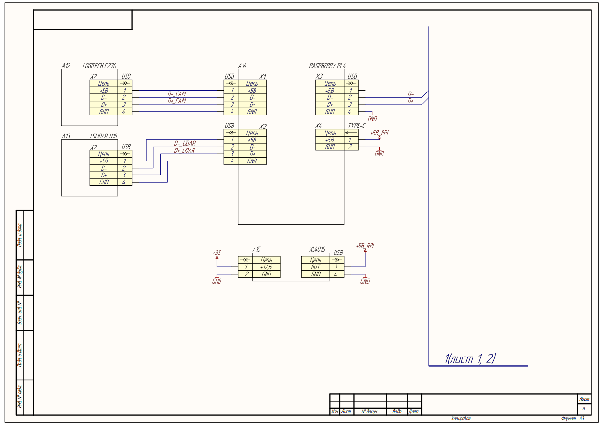

# Электроника проекта

С логикой подключения электроники можно ознакомится на [схеме Э3](files/Э3.pdf)
Arduino UNO вместе с драйвером L298 управляют моторами, arduno также обрабатывает показания с концевиков, mpu и энкодеров, управляет пищалкой и сервоприводами. 

Связь arduino и raspberry осуществляется через usbB-usb, ВАЖНО ЧТО У USB КОТОРАЯ ВТЫКАЕТСЯ В RASPBERRY ИЗОЛИРОВНЫ 5В (в нашем случае изолентой)

К raspberry также подключается камера и лидар.

Питание осуществляется от 3S аккумулятора, для arduino сторонний стабилизатор не используется, lm2596 испльзуется для сервоприводов, xl4015 для raspberry pi. Аварийная кнопка останавливает только питание arduino разрывая питание входящее в шилд.
