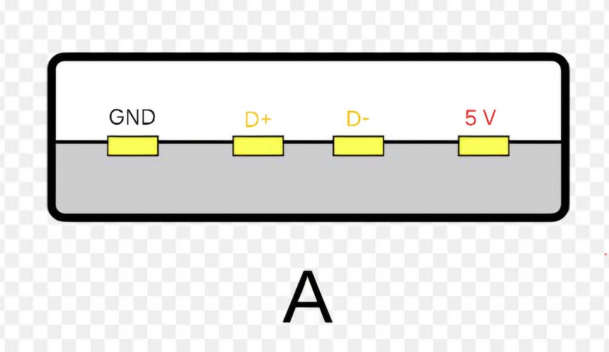
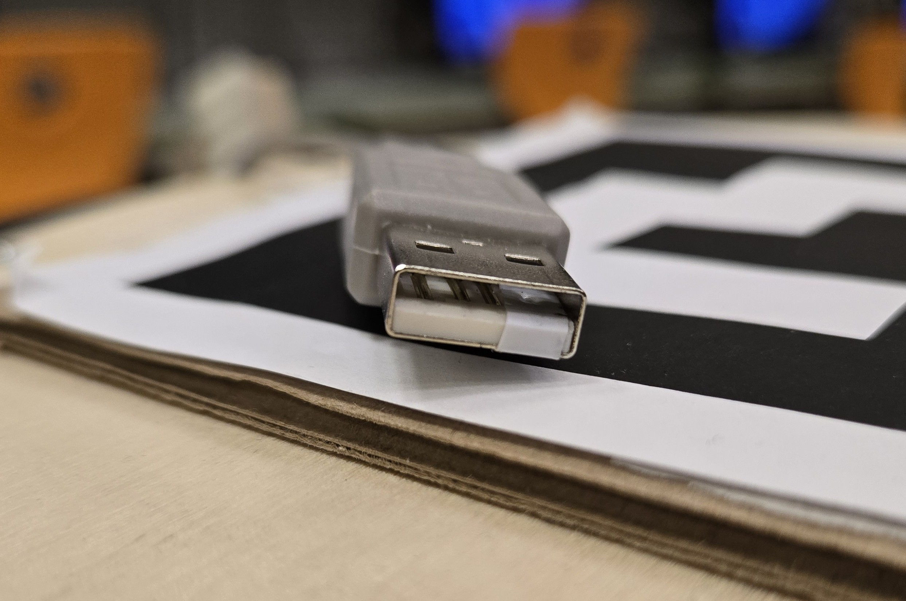

# Инструкции и документация

## Конструкция робота

Все самостоятельно разработанные детали робота были либо вырезаны на
лазерном станке, либо напечатаны на 3D-принтере. Исходные файлы проекта доступны [здесь](https://disk.yandex.ru/d/OX-B2bhMUjPgxg).

## Сборка робота

Шаг 1. Вырезать деталь 1 этажа, закрепить на ней держатель аккумуляторов и моторы

Шаг 2. Приклеить лидар на тонкий слой термоклея. Важно соблюсти его ориентацию относительно робота

Шаг 3. На 50 мм стойки прикрутить второй этаж. На нем расположить: тумблер, стабилизатор, плату Arduino с шилдом, макетную плату для гироскопа

Шаг 4. Теперь можно закрепить на нижней платформе манипулятор и концевые выключатели с приклеенными на термоклей усиками

Шаг 5. Подключить всю периферию к основному контроллеру. После установки третьего этажа доступ к контроллеру будет ограничен, и подключить все будет сложнее

Шаг 6. На 50 мм стойки поставить третий этаж. Закрепить на нем второй стабилизатор и Raspberry Pi

Шаг 7. Подключить питание микрокомпьютера к стабилизатору и соединить Raspberry Pi с Arduino кабелем USB-A - USB-B. Важно, что на нашем роботе на кабеле со стороны разъема USB-A изолентой заклеен пин 5 В. Это не дает плате Arduino питаться от Raspberry Pi при отсутствии основного питания, например при нажатии аварийной кнопки.  
 

Шаг 8. На 50 мм стойки закрепить 4 этаж. На нем закрепить крепление камеры вместе с камерой и аварийную кнопку. Важно, что во избежание люфта кнопки стоит поставить 4 мм проставку между ее корпусом и этажом

Шаг 9. Приклеить ArUco-маркер на крышу робота

## Список компонентов и ссылок

| № | Название | Назначение | Ссылка | Количество |
|---|---|---|---|---|
| 1 | Raspberry Pi 4B | запуск ROS, обработка лидара, обмен данными с Arduino | [AliExpress](https://aliexpress.ru/item/1005006733203166.html?shpMethod=CAINIAO_STANDARD&sku_id=12000038121994670&spm=a2g2w.productlist.search_results.2.791b7173iCNzRV) | 1 |
| 2 | Logitech C270 | детектирование ChArUco-доски, детектирование робота и распознавание объектов на стартовых позициях | [AliExpress](https://aliexpress.ru/item/1_326088900.html?shpMethod=MYMALL_PUDO_CITY&sku_id=5000001771211348&spm=a2g2w.productlist.search_results.2.26606142O9DDxi) | 1 |
| 3 | Грибок аварийного выключения | аварийное отключение питания | [Ozon](https://www.ozon.ru/product/knopka-avariynoy-ostanovki-gribok-povorotnaya-s-fiksatsiey-ip40-220v-10a-2-kontakta-kruglaya-302434565/?__rr=1&abt_att=1&from=share_android&perehod=smm_share_button_productpage_link) | 1 |
| 4 | Arduino Uno | управление моторами, считывание IMU и концевиков, управление сервоприводами | [AliExpress](https://aliexpress.ru/item/1005004073975153.html?sku_id=12000027951952147&spm=a2g2w.productlist.search_results.1.492a7108o6IxvA) | 1 |
| 5 | Motor Shield L298 | драйвер моторов с запасом по напряжению | [iArduino](https://iarduino.ru/shop/Expansion-payments/Motor-Shield-L298.html) | - |
| 6 | MG946R | подъем захвата вверх и вниз | [AliExpress](https://aliexpress.ru/item/4000502044588.html?shpMethod=CAINIAO_ECONOMY&sku_id=10000002401622860&spm=a2g2w.productlist.search_results.0.333b1e2dUa2pgS) | 1 |
| 7 | MG90 | управление схватом захвата | [Ozon](https://www.ozon.ru/product/2sht-servoprivod-mg90-s-micro-servo-servomotor-mg90s-3-7-2v-ampertok-tower-pro-mg90-180-micro-servo-3539223449/?at=99trKOyN8uEXOOZRIBXLRjwiMPgvyYCZmXNx4SP5jBwx) | 1 |
| 8 | Интерфейсный кабель USB-A - USB-B | соединение Raspberry Pi с Arduino Uno | - | 1 |
| 9 | Лидар | определение направления на объект при стыковке | [AliExpress](https://aliexpress.ru/item/1005007075882801.html?sku_id=12000039319951496&spm=a2g2w.productlist.search_results.1.71386cc4A9SN2X) | 1 |
| 10 | Тумблер питания | плановое включение и выключение питания | [AliExpress](https://aliexpress.ru/item/1005001994328465.html?shpMethod=CAINIAO_SUPER_ECONOMY&sku_id=12000018349863568&spm=a2g2w.productlist.search_results.14.39af6b6fiEPdyS) | 1 |
| 11 | LM2596 | понижение 12 В до 5 В для сервоприводов | [AliExpress](https://aliexpress.ru/item/1005003780274326.html?shpMethod=CAINIAO_SUPER_ECONOMY&sku_id=12000027142887130&spm=a2g2w.productlist.search_results.0.2406603cc2VEip) | 1 |
| 12 | XL4015 с вольтметром | контроль напряжения аккумулятора и питание Raspberry Pi по USB | [Yandex Market](https://market.yandex.ru/cc/975WaF) | 1 |
| 13 | Пищалка | сигнализация о разряде аккумулятора | [AliExpress](https://aliexpress.ru/item/1005008750369827.html?shpMethod=CAINIAO_SUPER_ECONOMY&sku_id=12000048410563277&spm=a2g2w.productlist.search_results.10.17d02d3dn7qfj3) | 1 |
| 14 | Отсек для аккумуляторов | крепление аккумуляторов | [AliExpress](https://aliexpress.ru/item/1005004036301580.html?shpMethod=MYMALL_PUDO_CITY&sku_id=12000038184077606&spm=a2g2w.productlist.search_results.16.34eb1513XqHAnU) | 1 |
| 15 | Концевик | фиксация контакта с препятствием | [AliExpress](https://aliexpress.ru/item/1005008634065991.html?shpMethod=CAINIAO_SUPER_ECONOMY&sku_id=12000046037034310&spm=a2g2w.productlist.search_results.2.427f1a68Dnmn14) | 2 |
| 16 | Колеса 85 мм | движение робота | [Ardmag](https://ardmag.ru/mehanics/wheels/1674.html) | 2 |
| 17 | DC-мотор 12 В + крепеж | привод колес | [AliExpress](https://aliexpress.ru/item/32855724293.html?sku_id=12000041529946492&spm=a2g2w.productlist.search_results.4.61f341acMpGT7g) | 2 |
| 18 | Муфта для крепления колеса на вал мотора | шестигранник 2.0 | [AliExpress](https://aliexpress.ru/item/1005010112043572.html?shpMethod=CAINIAO_STANDARD&sku_id=12000051184522905&spm=a2g2w.productlist.search_results.4.6aa161cc42L3Hx) | 2 |
| 19 | Макетные провода всех типов | монтаж и прототипирование соединений | - | - |
| 20 | Резисторы для делителя | сборка делителя напряжения | - | - |
