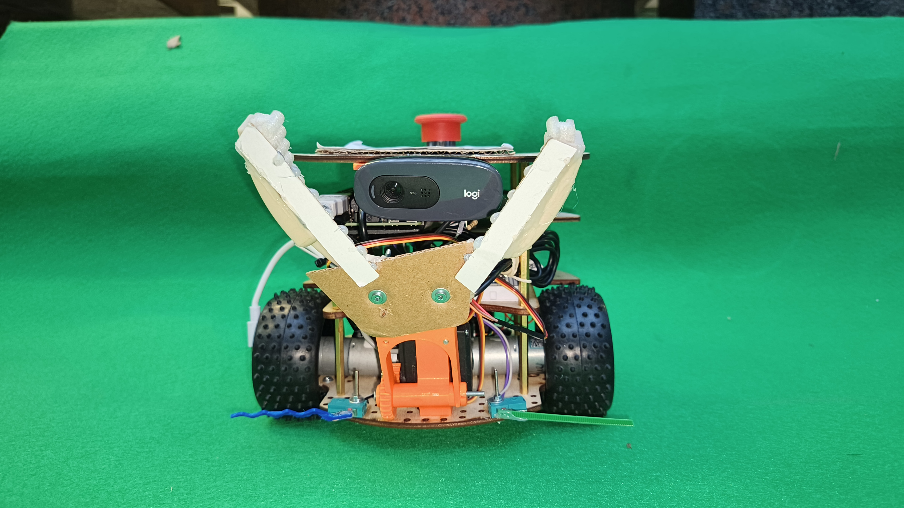
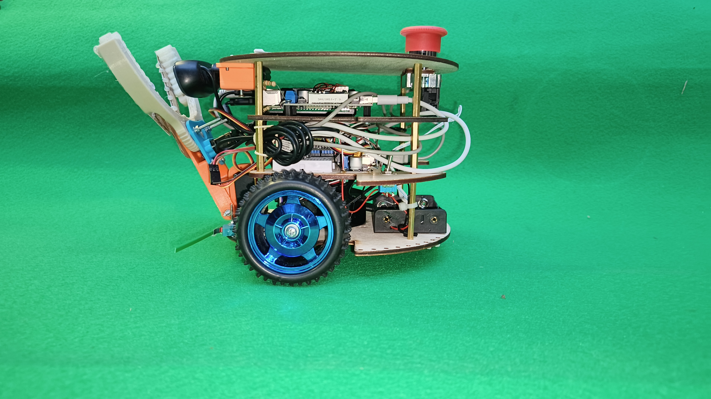
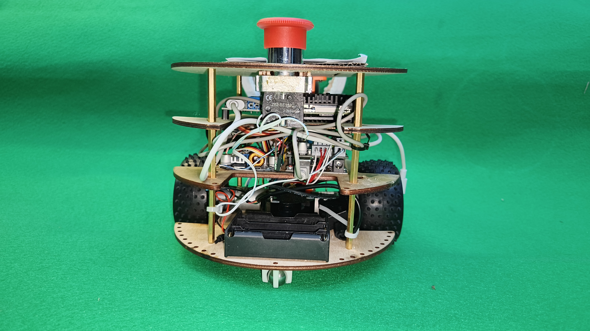
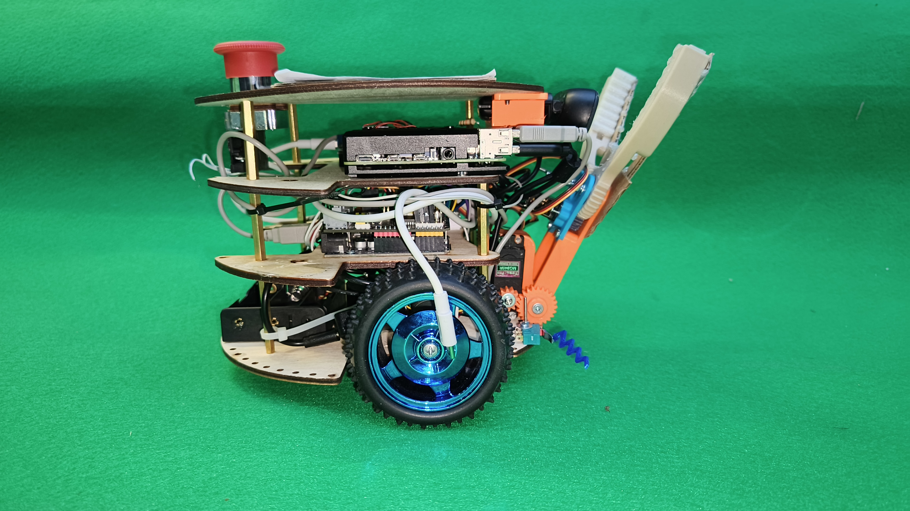
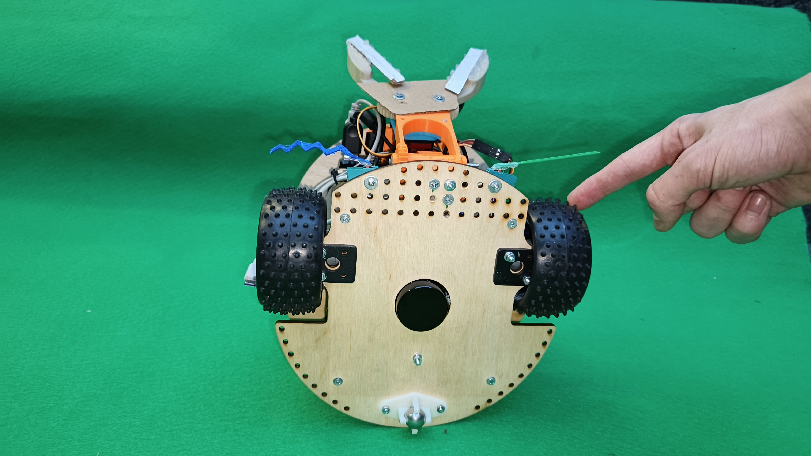

# Аппаратная часть

Робот представляет из себя тележку с дифференциальным приводом и волокушей, манипулятором, контроллером Arduino Uno и одноплатным компьютером Raspberry Pi 4B.

## Внешний вид робота

