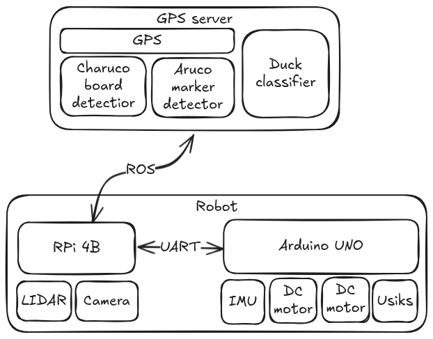

# Документация ROS2 робота команды nedoROS

## Описание проекта
Проект был создан для соревнований ROS2 роботов, проходящих в рамках [ROS Meetup '26](https://rosmeetup.ru/). Подробнее с регламентом можно ознакомиться [здесь](https://docs.google.com/document/d/1AtKmbw3KTXKiFeh0tXYimORqyVAXmOqKZu3mUj7AqFk/edit?tab=t.0).  
На соревнованиях перед участниками была поставлена цель: создать робота, работающего на ROS2, способного классифицировать объекты на известном полигоне и перевозить их в определенную зону.
Для выполнения поставленной цели можно было пользоваться несколькими из разрешенных устройств на полигоне, около или над полигоном, на роботе:  
1. Робот  
2. Модуль на перекладине  
3. Ноутбук рядом с полем  
4. Камеру на роботе  
Наша команда выбрала комбинацию из робота, модуля на перекладине и ноутбука рядом с полем.  

Нами был создан робот, имеющий два контроллера: микрокомпьютер Raspberry Pi 4 и контроллер Arduino UNO на основе микроконтроллера ATmega328P. К контроллерам подключены гироскоп, сервомоторы двухзвенного манипулятора, концевые выключатели и лидар. Робот имеет дифференциальный привод на основе двух коллекторных моторов с энкодерами. Raspberry Pi обменивается данными с ноутбуком вне полигона по Wi-Fi и с Arduino UNO по протоколу UART.  
На ноутбуке обрабатывается изображение с камеры, висящей над полигоном. На микрокомпьютер приходят данные о том, какие объекты стоят на каких местах и в какой точке полигона в данный момент находится робот. Далее программа на Raspberry Pi в зависимости от расположения объектов просчитывает маршрут из текущего положения робота в точку, близкую к самому дорогому по баллам из ближайших объектов. Программа отсылает на Arduino обновленные значения скоростей для моторов. Когда робот доезжает до заданной точки, он начинает стыковку с объектом с помощью лидара, а далее, когда стыковка завершена,  отсылает на Arduino команду о захвате объекта. После этого робот отправляется на точку выгрузки объектов, после чего начинает поиск нового объекта.

## Общая схема системы

