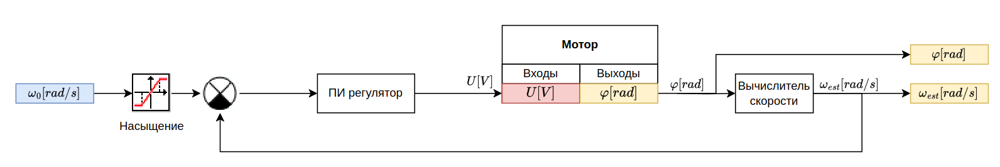
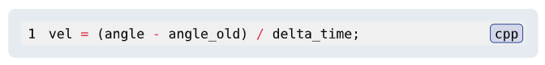
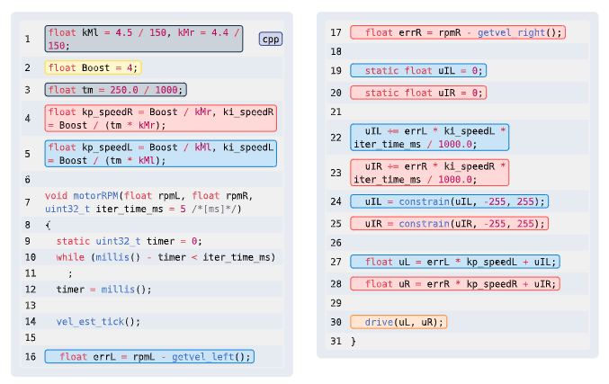
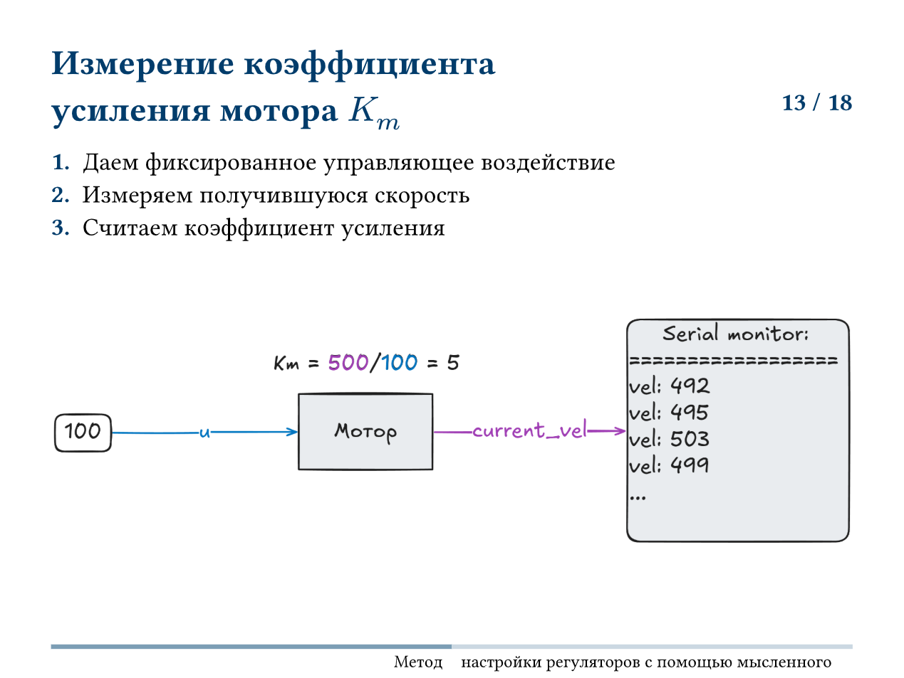
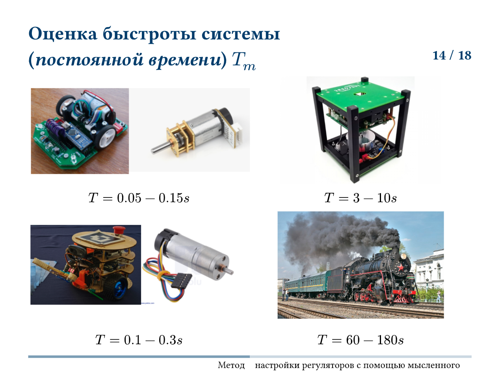
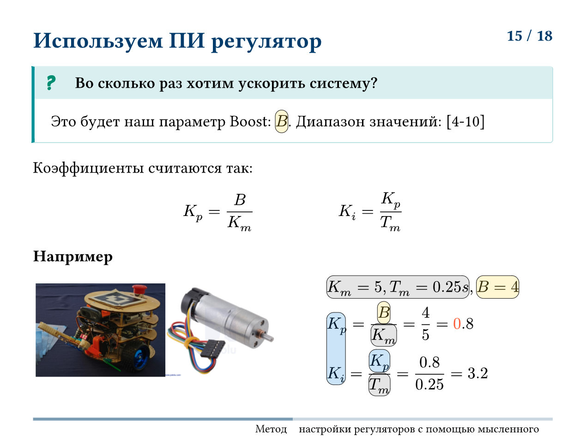
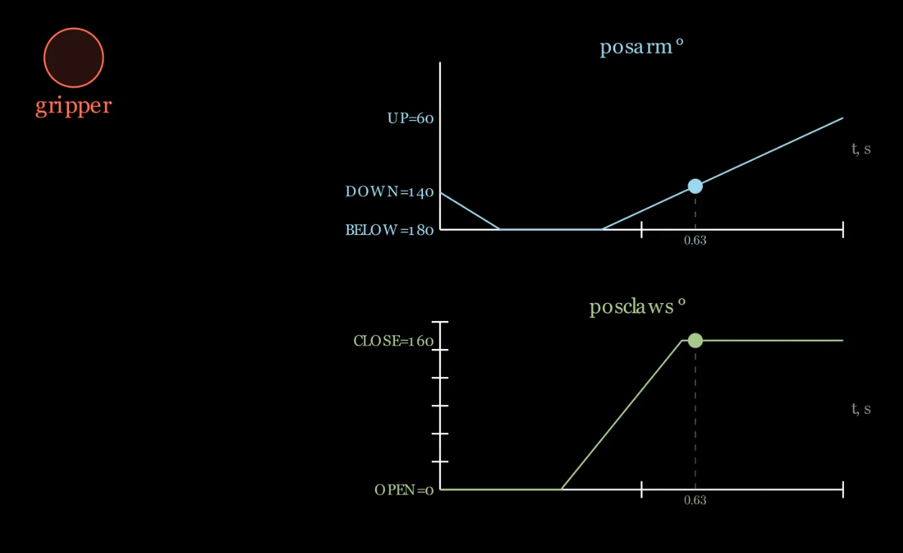

# Прошивка микроконтроллера

Робот управляется контроллером Arduino Uno, подключенным по протоколу UART к Raspberry Pi 4B. Является уровнем Секвенсора трехуровневой архитектуры.

## Задачи контроллера

- Замыкание ПИ регуляторов скорости моторов
- Управление сервоприводами захвата
- Расчет локальной одометрии
- Считывание датчиков и пересылка их наверх

## Интерфейс взаимодействия

Для управления роботом определен протокол типа запрос-ответ. Частота обмена Arduino-Raspberry соответствует частоте работы Секвенсора и составляет 10Гц.

Протокол обмена:

```
Rpi-Arduino:
Обычное управление:
|0x01|left_motor_speed:float|right_motor_speed:float|gripper:byte|checksum:byte|
11 bytes

Arduino-Rpi:
Ответ на обычное управление:
|0x01|x:float|y:float|theta:float|usik_left:byte|usik_right:byte|checksum:byte|
16 bytes
```

## Управление моторами



### Вычислитель скорости



### ПИ регуляторы скорости



### Настройка коэффициентов

Метод мысленного эксперимента и подбора.







## Локальная одометрия

```cpp
float x = 0.0, y = 0, theta = 0;

float dist_i = 0.0, theta_i = 0.0;

void odom() {
  static int64_t old_encL = 0;
  static int64_t old_encR = 0;

  float velL = (enc_get_tick_L() - old_encL) / Ts_s;
  float velR = -(enc_get_tick_R() - old_encR) / Ts_s;

  old_encL = enc_get_tick_L();
  old_encR = enc_get_tick_R();

  float vel = (velL + velR) / 2;

  if (fabs(gyro()) > 0.04)
    theta_i = gyro();
  else
    theta_i = 0;

  float k = 0.2 / 500;

  x += k * vel * cos(theta) * Ts_s;
  y += k * vel * sin(theta) * Ts_s;
  theta += theta_i * Ts_s;
}
```

## Управление сервоприводами

```cpp

    if (gripper_form_rpi())
    {
      t += t_one_it;
      t2 += t_one_it / want_t_claws;
    }
    else
    {
      t -= 0.5 * t_one_it;
      t2 -= 2 * t_one_it / want_t_claws;
    }

    t = constrain(t, 0, 1);
    t2 = constrain(t2, 0, 1);


    if (t < START_BELOW_TIME) {
      posarm = DOWN;     
    } else if (t < BELOW_TIME) {
        posarm = fmap(t, START_BELOW_TIME, BELOW_TIME, DOWN, BELOW);
    } else {
        posarm = constrain(fmap(t, (1 - want_t_claws), 1, BELOW, UP), UP, BELOW);
    }
    posclaws = constrain(fmap(t2, 0.5, 1, OPEN, CLOSE), OPEN, CLOSE);
```

Программирование циклограм движения сервоприводов захвата


