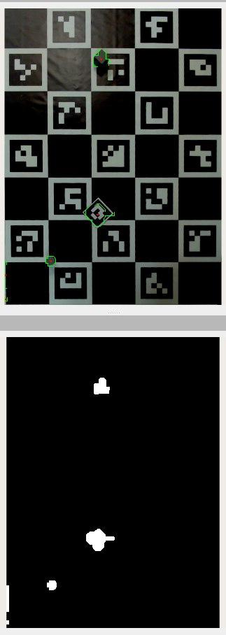
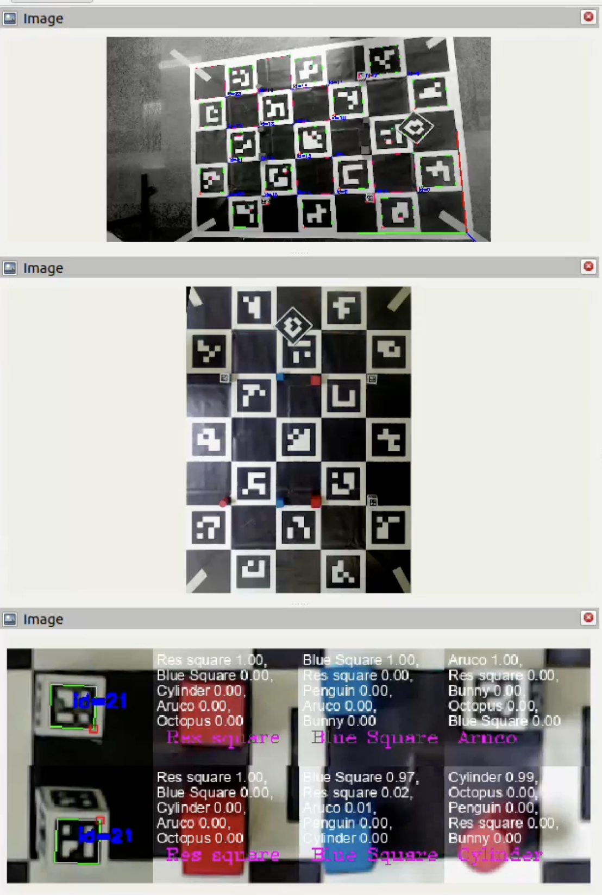

# Описание алгоритмов, работающих на уровне компьютера с камерой над Charuco-доской

## Общая схема
```
┌──────────── Изображение с камеры
│               │              │
│               ▼              ▼
│  ┌───────────────────┐ ┌───────────────────┐
│  │Определение позиции│ │Определение позиции│
│  │   charuco-доски   │ │   aruco-маркера   │
│  └────┬───────┬──────┘ └────┬──────────────┘
│       │       │             │  
│       │       ▼             ▼
│       │     ┌──────────────────┐
│       │     │Вычисление позиции│
│       │     │ маркера на доске │
│       │     └──────────────────┘
│       │               │
│       │               ▼
│       │      Отправка на робота
▼       ▼
┌───────────────────┐
│"Выпрямление" доски│
│ по известной поз. │
└───────────────────┘
         │
         ▼
┌───────────────────┐
│  Определение  16  │
│ стартовых позиций │
└───────────────────┘
         │
         ▼
┌───────────────────┐
│Определение объекта│
│    в  каждой из   │
│ стартовых позиций │
└───────────────────┘
         │
         ▼
 Отправка на робота
```

## Запуск

Для удобного запуска реализован launch-файл [all.launch.py](../../charuco_ws/src/nedo_bringup/launch/all.launch.py), который запускает:
- `usb_cam_node_exe` для получения изображения с камеры
- `charuco_detector` для распознавания и получения координат доски
- `apriltag_pose_detector_node` для распознавания и получения координат маркера
- `pose_recalibrator` для получения координат маркера в относительных координатах доски
- `charuco_rectifier_node` для "выпрямления" доски по известной позиции и распознавания объектов

В этом же файле находятся все основные настройки, например параметры aruco-маркера, названия топиков и т.д.

## charuco_rectifier_node

Нода получает изображение с камеры, откалиброванные параметры камеры (типа искажения, разрешения и т.д.) и позицию доски относительно камеры. Используя эти данные, мы можем определить позиции углов доски в пикселях на изображении, и по ним "выпрямить" доску, то есть получить прямоугольное изображение, углы которого соответствуют углам доски и расстояние в пикселях соответствует расстоянию в миллиметрах на реальной доске.



Так как мы точно знаем стартовые позиции объектов, мы получить изображения каждого из объектов, обрезая матрицу изображения с выровненной доской



Это скрин отладочных выводов в RViz. Здесь видно как нарезаются картинки для каждого объекта, которые по одной передаются в модуль распознавания (подробнее [тут](./duck_classifier.md)), который определяет тип и возвращает его нам.

Код определяет все 16 объектов. Если симметричные объекты совпадают (по регламенту расположение объектов симметрично в начале матча), значит вероятность ошибки мала и код отправляет на робота список, сопоставляющий номер позиции на поле с объектом который там стоит. Когда центральный тег открывается (начало игры и запуск роботов) мы больше не распознаем объекты и отправляем последний список который увидели