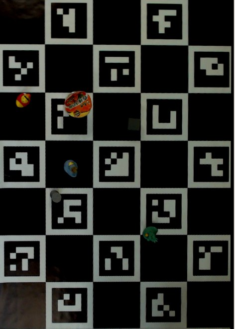
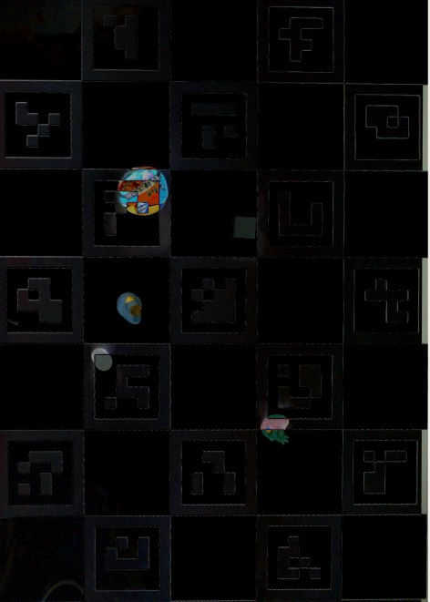

# Сервер GPS и классификации объектов

### [Видео с демонстрацией работы GPS и классификации объектов](./img/video_demo.mp4)

## Общая схема
```
┌──────────── Изображение с камеры
│               │              │
│               ▼              ▼
│  ┌───────────────────┐ ┌───────────────────┐
│  │Определение позиции│ │Определение позиции│
│  │   charuco-доски   │ │   aruco-маркера   │
│  └────┬───────┬──────┘ └────┬──────────────┘
│       │       │             │  
│       │       ▼             ▼
│       │     ┌──────────────────┐
│       │     │Вычисление позиции│
│       │     │ маркера на доске │
│       │     └──────────────────┘
│       │               │
│       │               ▼
│       │      Отправка на робота
▼       ▼
┌───────────────────┐
│"Выпрямление" доски│
│ по известной поз. │
└───────────────────┘
         │
         ▼
┌───────────────────┐
│  Определение  16  │
│ стартовых позиций │
└───────────────────┘
         │
         ▼
┌───────────────────┐
│Определение объекта│
│    в  каждой из   │
│ стартовых позиций │
└───────────────────┘
         │
         ▼
 Отправка на робота
```

## Запуск

Для удобного запуска реализован launch-файл [all.launch.py](../../charuco_ws/src/nedo_bringup/launch/all.launch.py), который запускает:
- `usb_cam_node_exe` для получения изображения с камеры
- `charuco_detector` для распознавания и получения координат доски
- `apriltag_pose_detector_node` для распознавания и получения координат маркера
- `pose_recalibrator` для получения координат маркера в относительных координатах доски
- `charuco_rectifier_node` для "выпрямления" доски по известной позиции и распознавания объектов

В этом же файле находятся все основные настройки, например параметры aruco-маркера, названия топиков и т.д.

## usb_cam_node_exe

Используется стандартный usb_cam для получения изображения с камеры, отправляется в топик `/image_raw`. Также, для корректной работы нод, камера была откалибрована и данные о камере передаются в топик `/camera_info`.

В папке [charuco_ws/src/usb_cam](../../charuco_ws/src/usb_cam) находятся файлы с настройками камеры. Там важно изменить все параметры камеры под свою, также полезно настраивать яркость (brightness) до сборки датасета и использования распознавания объектов.

## charuco_detector

Нода определяет арукомаркеры на изображении и по их позициям, зная искажение камеры и расположение маркеров на доске, определяет позицию доски относительно камеры. Публикует tf2 топик `/image_raw_charuco_pose` с координатами доски относительно координат камеры.

За основу взят репозиторий [charuco_detector_ROS2](https://github.com/errrr0501/charuco_detector_ROS2), портировавший на ROS2 репозиоторий [charuco_detector](https://github.com/carlosmccosta/charuco_detector).

## apriltag_pose_detector_node

Нода определяет все маркера на изображении, используется для получения координат робота (с маркером 239 семейства Aruco 250_4х4) и распознавания центрального маркера для определения старта игры.

Получение координат маркера в системе камеры аналогично получению координат charuco-доски, код представляет стандартный пример обнаружения маркеров библиотеки OpenCV2, обернутый в ROS2.

## pose_recalibrator

Нода получает tf2-топики `/image_raw_charuco_pose` и `/image_raw_apriltag_pose` и вычисляет координаты маркера в координатах доски (включая координаты центра маркера и его направление, то есть направление взгляда робота). Преобразование делается стандартным ROS2-методом для tf2.

Полученные координаты отправляются на робота через топик `/image_recalib_apriltag_pose`.

## charuco_rectifier_node

Нода получает изображение с камеры, откалиброванные параметры камеры (типа искажения, разрешения и т.д.) и позицию доски относительно камеры. Используя эти данные, мы можем определить позиции углов доски в пикселях на изображении, и по ним "выпрямить" доску, то есть получить прямоугольное изображение, углы которого соответствуют углам доски и расстояние в пикселях соответствует расстоянию в миллиметрах на реальной доске.


Так как мы точно знаем стартовые позиции объектов, мы получить изображения каждого из объектов, обрезая матрицу изображения с выровненной доской


Это скрин отладочных выводов в RViz. Здесь видно как нарезаются картинки для каждого объекта, которые по одной передаются в модуль распознавания (подробнее [тут](./duck_classifier.md)), который определяет тип и возвращает его нам.

Код определяет все 16 объектов. Если симметричные объекты совпадают (по регламенту расположение объектов симметрично в начале матча), значит вероятность ошибки мала и код отправляет на робота список, сопоставляющий номер позиции на поле с объектом который там стоит. Когда центральный тег открывается (начало игры и запуск роботов) мы больше не распознаем объекты и отправляем последний список который увидели


# Apendix

## ___Идеи дальше остались на стадии разработки___

Высь код можно найти в файле [charuco_rectifier_node.py](../../charuco_ws/src/charuco_rectifier/charuco_rectifier/charuco_rectifier_node.py#177-234)

Изначально мы планировали определять позиции объектов с камеры над полем, так как думали что их стартовое расположение будет случайным. Для этого мы сначала калибровались, запоминая изображение поля без объектов и роботов на нем (уже "выпрямленное"). Возьмем такое изображение 



Теперь работаем с картинками как с матрицами - ___вычисляем модуль разности для каждого пикселя___ между калибровочным изображением и картинки с поля. Если попробовать вывести полученную матрицу, получим следующее



Видно, что рисунок самой доски почти уходит (что легко исправляется морфологическими преобразованиями), а объекты легко отличимы глазом на полученном изображении.

Проблема возникает с тем, что такая разность слишком чувствительна к изменениям в освещении, особенно к теням на поле, из-за чего приходится сильно обрабатывать полученную матрицу, но из нее можно получить хорошую маску (хотя бы в тепличных условиях)


Первое большое пятно - нашего робота, легко выкинуть зная его координаты. Второе большое пятно - робот противника, выкинем его и объекты с запасом вокруг. Всё что осталось - какие-то игровые объекты, зная их точную позицию на изображении, можем обрезать кадр и отправить в модуль распознавания, как описано выше

## Apendix's appendix

В той же ноде [charuco_rectifier_node](../../charuco_ws/src/charuco_rectifier/charuco_rectifier/charuco_rectifier_node.py) планировалось составлять маршрут для робота с объездом дешевых объектов и вражеского робота. Но увидев регламент самого хакатона, мы решили просто доставлять в зону выгрузки ближайшие объекты, отдавая приоритет более дорогим. 

На взаимодействие с противником мы не рассчитывали, но оставили на всякий случай "усики", которые не дают роботу таранить объекты, но об этом подробнее в части про хардвар