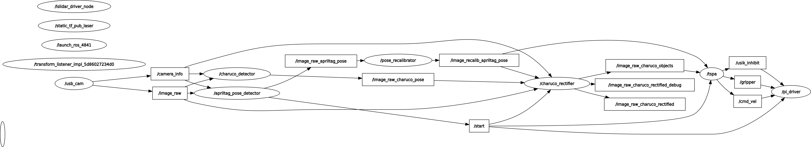

# Обзор системы управления

Система управления представляет собой модифицированную трехуровневую архитектуру с элементами архитектуры подчинения (subsumption).

## О трехуровневой архитектуре

Трехуровневая архитектура разделяет функции управления на три временных масштаба и уровня абстракции: делиберативный (планирование), секвенциальный (координация) и реактивный (непосредственное управление).

```
   Цель / задача
        │
        ▼
┌─────────────────┐
│  Делибератор    │ ← глобальная модель, логический вывод
└────────┬────────┘
         │ план (последовательность этапов)
         ▼
┌─────────────────┐
│  Секвенсор      │ ← конечный автомат, мониторинг условий
└────────┬────────┘
         │ примитивные команды (скорость, позиция, усилие)
         ▼
┌─────────────────┐
│  Контроллер     │ ← ПИД, обратная связь с датчиками
└────────┬────────┘
         │ данные (ток, положение, контакт)
         ▼
   Физическая система / робот
```

### Контроллер

Роль Контроллера - реактивное управление роботом в реальном времени. На этом уровне замыкаются контуры обратной связи (ПИД регуляторы) и выполняются примитивные команды.

В нашей системе представлен контроллером Arduino Uno, задачей которого является максимально точно отрабатывать данное ему сверху задание по управлению.

В частности, здесь реализованы:
- ПИ регуляторы скорости моторов;
- Программирование циклограм движения сервоприводов захвата;
- Локальная одометрия.

Частота главного цикла нашего Контроллера составляет 100Гц, что обеспечивает высокую отзывчивось моторов.

> Заметка: здесь и далее термин "контроллер" используется в двух смыслах: физический контроллер Arduino Uno, стоящий на роботе, и контроллер как элемент трехуровневой архитектуры системы управления. Во избежание путаницы первый будет писаться с маленькой буквы, второй - с большой.

### Секвенсор

Роль Секвенсора - координация действий робота и выполнение длительных задач.

Он:

- принимает план действий от Делибератора,
- разбивает план на конкретные шаги и формирует уставки для Контроллера,
- отслеживает выполнение действий и обрабатывает ошибки.

Главный цикл Секвенсора имеет частоту 10Гц.

На этом уровне определены элементарные поведения, которые роботу необходимо выполнять для реализации задачи. Для переключения между поведениями используется модифицированная парадигма ITSPA, позволяющая использовать для описания последовательности сложных поведений стандартные средства управления потоком исполнения программы без конечных автоматов.

В нашей системе представлен одноплатным компьютером Raspberry Pi 4B.

### Делибератор

Роль Делибератора - принятие стратегических решений и глобальное планирование.

В нашей системе как такового Делибератора нет, но если бы он был бы, он был бы реализован на сервере системы глобального позиционирования.

В нашей системе он отвечает за GPS (определение местоположения робота в глобальной системе координат) и классификацию объектов интереса (уточек).

## ROS

Общая схема топиков и нод представлена ниже:



Здесь секвенсор это нода `/tspa`. В ней происходит принятие решений и обработка всех сигналов. Самая правая нода `/pi_driver` отвечает за взаимодействие с контроллером Arduino Uno по UART. Все остальные ноды отвечают за GPS и классификацию уточек.
