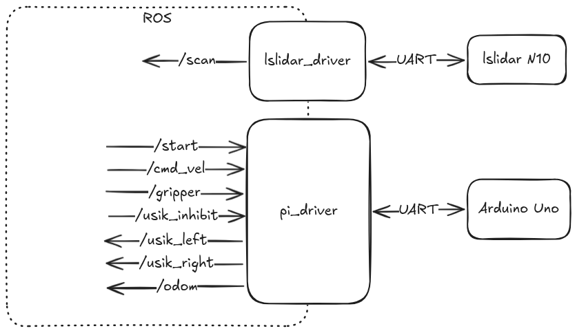

# Прошивка одноплатного компьютера Raspberry Pi

Программа на Raspberry Pi представляет собой уровень Секвенсора трехуровневой архитектуры. Она агрегирует в себе все данные о роботе от Контроллера и Делибератора, формирует план действий и выдает уставки для Контроллера.

## ROS

На роботе установлена RPi 4B. На ней поднят ROS Humble в виде Docker контейнера.
Образцу работы с ROS через докер мы обязаны Дема Николаю и хакатону Starline.

### Пара слов об управлении роботом через контейнер

Как вообще происходит общение ROS с внешним миром? У самого ROS нет никаких способов взаимодействия с чем-либо, кроме себя. В то же время микроконтроллер и лидар у нас подключаются физически по USB и общаются по UART.

Для взаимодействия с такими устройствами нам необходимо дать контейнеру доступ к физическим устройствам (к папке `/dev/` в Linux) и сделать специальные ноды для взаимодействия с такими устройствами - **драйвера**.

## Драйверы

В широком смысле драйвер - устройство или ПО для преобразования сигналов из одного формата в другой. Драйвер мотора преобразует слабый логический сигнал управления в силовой сигнал, подающийся на мотор. Драйвер принтера преобразует сигнал в виде файла на печать в последовательность байтов, отправляемых на физический принтер через USB.

В контексте ROS мы называем драйвером такую ноду, которая обеспечивает связь с внешним миром и транслирует ROS-топики в соответствующие форматы для внешнего мира.



### Драйвер лидара

У нас на роботе стоит лидар LSLidar N10 v1.0. Для него есть готовый драйвер от разработчиков, находящийся [здесь](https://github.com/Lslidar/Lslidar_ROS2_driver).

### Драйвер робота

Задача драйвера робота - подключиться к Arduino Uno по установленному протоколу и перегонять команды из топиков ROS на Arduino и обратно. В коде это нода `pi_driver` в файле [rpi_ws/workspace/src/pi_driver/pi_driver/pi_driver_node.py](https://github.com/arsenier/nedoROS/blob/main/rpi_ws/workspace/src/pi_driver/pi_driver/pi_driver_node.py).


Протокол обмена:

```
Rpi-Arduino:
Обычное управление:
|0x01|left_motor_speed:float|right_motor_speed:float|gripper:byte|checksum:byte|
11 bytes

Arduino-Rpi:
Ответ на обычное управление:
|0x01|x:float|y:float|theta:float|usik_left:byte|usik_right:byte|checksum:byte|
16 bytes
```

При запуске драйвер ожидает команды на старт попытки. После получения этой команды он начинает общение с Arduino с частотой 10Гц.

Также в драйвере происходит обработка сигналов с усиков, и при необходимости он перехватывает управление роботом и отъезжает назад во избежание столкновения. Подобное поведение можно описать как элемент архитектуры subsumption.

## Управление роботом

Вся логика управления роботом сосредоточена в одной ноде `tspa`. Работа с топиками осуществляется как с датчиками и исполнительными узлами, как в обычном микроконтроллере. Нода подписывается на необходимые ей топики и при получении данных сохраняет их в глобальные переменные. Таким образом, нода хранит самое актуальное состояние всей системы.

### Локатор уточек

Данные с лидара при поступлении от драйвера лидара обрабатываются для получения координат ближайшей уточки. С точки зрения робота это выглядит как датчик, который выдает координаты ближайшей к нему уточки.

## Элементарные поведения

Поведение робота разбито на элементарные поведения, которые потом вызываются в определенном порядке для управления роботом. Список элементарных поведений:

- Ожидание старта попытки
- Ожидание цели
- Движение к цели
- Стыковка
- Захват
- Движение в зону
- Сброс в зону
- Ожидание по времени

В центре всей системы существует главный цикл `main_loop`, который вызывает поведения и выдает ими сгенерированные управляющие воздействия:

```python
    def main_loop(self):
        clock = self.get_clock()
        currenttime = clock.now()
        self.usik_inhibit.data = False
        self.timestate = currenttime.nanoseconds / 1e9 - self.timelastbeh
        if self.current_behaviour == Behaviour.WAIT_TARGET_LIST:
            self.get_logger().info(f'Waiting start ans list of ducks, start = {self.is_start}, duck list = {self.duck_class_mas}')
        elif self.current_behaviour == Behaviour.WAIT_TARGET:
            self.twist = Twist()
            self.get_logger().info('Waiting for target')
        elif self.current_behaviour == Behaviour.GO_TO_TARGET:
            self.goToPose(self.duck_pose)
            self.get_logger().info(f'Going to target {self.duck_pose}')
        elif self.current_behaviour == Behaviour.DOCK_WITH_DUCK:
            self.object_docking()
            self.get_logger().info(f'Docking with duck {self.duck_locator}')
        elif self.current_behaviour == Behaviour.GRAB_THE_DUCK:
            self.twist = Twist()
            self.twist.linear.x = 0.1
            self.get_logger().info('Grabbing the duck')
        elif self.current_behaviour == Behaviour.GO_TO_PBASE:
            self.goToPose(self.baze_pose)
            self.get_logger().info('Going to pbase')
            self.usik_inhibit.data = True
        elif self.current_behaviour == Behaviour.GO_TO_NBASE:
            self.goToPose(self.enemy_baze_pose)
            self.get_logger().info('Going to nbase')
        elif self.current_behaviour == Behaviour.DROP_THE_DUCK:
            self.twist = Twist()
            self.twist.linear.x = -0.08
            self.usik_inhibit.data = True
            self.gripper.data = False
            self.get_logger().info('Dropping the duck')
        elif self.current_behaviour == Behaviour.WAIT_TIME:
            self.twist = Twist()
            self.get_logger().info(f'Waiting... {self.timestate}')

        # self.get_logger().info(f'Current subs: {self.current_subs}')
        self.get_logger().info(f'GPS: {self.robot_pose}, duck list: {self.duck_class_mas}, Control: {self.twist}, {self.gripper},{self.usik_inhibit}')

        self.twist_pub.publish(self.twist)
        self.gripper_pub.publish(self.gripper)
        self.usik_inhibit_pub.publish(self.usik_inhibit)
```

Этот цикл вызывается ROS-таймером с частотой 10Гц.

Для каждого поведения определена управляющая логика, которая либо находится прямо в функции `main_loop`, либо находится в соответствующей функции (как например `goToPose` и `object_docking`).

Каждое поведение не блокирующее и выполняется очень быстро. Как же тогда реализованы задержки и переключения между ними?

## Переключение поведений

Обычно, ноды запускаются в функции `main` командой `rclpy.spin(node)`. Это запускает ноду и передает управление полностью ей. Однако в таком случае очень сложно делать сложные поведения и переключаться между ними. Требуется делать конечные автоматы, условия перехода и код получается очень громоздким и хрупким.

Мы пошли другим путем.

Для запуска поведения используется следующая конструкция:

```python
def run_behaviour(node, behaviour, until = lambda: False):
    node.set_behaviour(behaviour)
    while rclpy.ok():
        rclpy.spin_once(node)
        if until():
            break
```

Мы говорим ноде какое поведение мы хотим запустить. После этого мы входим в бесконечный цикл, в котором постоянно вызываем функцию `rclpy.spin_once(node)`, что позволяет ROS слушать паблишеры, использовать таймеры и отправлять данные в подписанные на нас ноды. А для того чтобы выйти из поведения, мы используем условие `until`, которое называем условием выхода из поведения. Если условие сработает, то цикл завершается и мы переходим дальше по программе.

## Общая логика программы

Имея подобную инфраструктуру мы можем описать логику поведения робота с помощью последовательности элементарных поведений. Наша итоговая логика в попытках выглядит так:

```python
def main(args=None):
    # ...

    # Ждем пока нам не придет команда на старт попытки
    run_behaviour(node, Behaviour.WAIT_TARGET_LIST, until = lambda: node.is_start == True)

    while rclpy.ok():
        # Определяем самую дорогую уточку и ждем пока мы ее не получим (на случай если от сервера еще не пришла информация о стоимости уточек)
        node.give_best_by_first()
        run_behaviour(node, Behaviour.WAIT_TARGET, until = lambda: node.duck_pos_number is not None)

        # Определяем координаты уточки и двигаемся к ней пока не подъедем близко
        node.duck_pose = mirror_cordination(cordination_ducks[node.duck_pos_number], is_A_baze)
        run_behaviour(node, Behaviour.GO_TO_TARGET, until = lambda: \
            (dist(node.robot_pose, node.duck_pose) < robot_gotopoint_dist_threshold or node.twist.linear.x < 0.03) and \
                abs(node.err_theta) < 0.1 and node.timestate > 0.5)

        # Стыкуемся с уточкой пока не захватим
        run_behaviour(node, Behaviour.DOCK_WITH_DUCK, until = lambda: node.gripper.data == True)

        # Захватываем уточку в течение одной секунды
        run_behaviour(node, Behaviour.GRAB_THE_DUCK, until = lambda: node.timestate > 1)

        # Определяем координаты базы и двигаемся к ней пока не подъедем близко
        node.baze_pose = mirror_cordination(bazepos_centre, is_A_baze)
        run_behaviour(node, Behaviour.GO_TO_PBASE, until = lambda: \
            (dist(node.robot_pose, node.baze_pose) < robot_gotopoint_dist_threshold or node.twist.linear.x < 0.03) and \
                abs(node.err_theta) < 0.1 and node.timestate > 0.5)

        # Сбрасываем уточку и чуть-чуть ждем
        run_behaviour(node, Behaviour.DROP_THE_DUCK, until = lambda: node.timestate > 2)
        run_behaviour(node, Behaviour.WAIT_TIME, until = lambda: node.timestate > 1)

        # Начинаем цикл снова
```

Подобный подход позволяет легко писать сложные поведения, не теряя при этом в качестве работы регуляторов и в быстродействии робота.
